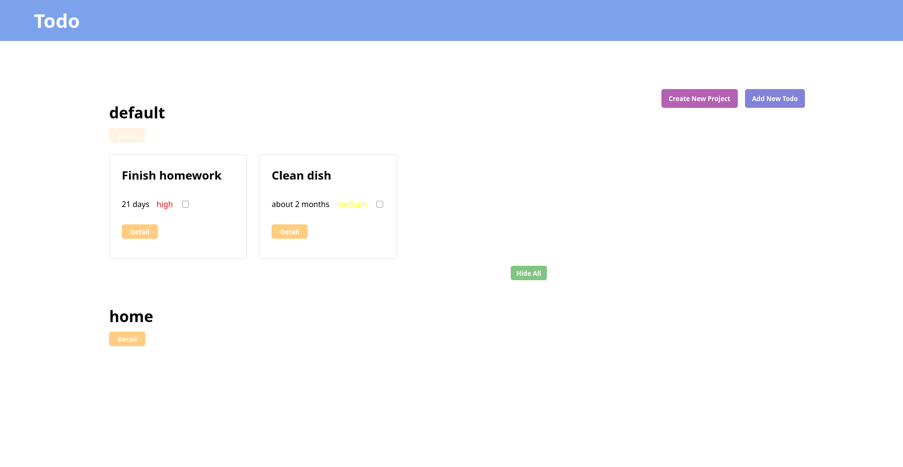

## Table of contents

- [Overview](#overview)
  - [The challenge](#the-challenge)
  - [Screenshot](#screenshot)
  - [Links](#links)
- [My process](#my-process)
  - [Built with](#built-with)
  - [What I learned](#what-i-learned)
  - [Continued development](#continued-development)

## Overview

### The challenge

Users should be able to:

- Create new project/todo
- View all projects.
- View all todos
- Expand a single todo to see/edit its details.
- Delete a todo.

### Screenshot



### Links

- Live Site URL: [Live Preview](https://azanra.github.io/odin-todo//)

## My process

### Built with

- Javascript module pattern and Factory

### What I learned

This way of creating dom element is not really scalable. because this method advantage is the we can still reference the element to be reused or manipulate later on without referencing it again

When putting event listener with function (not anonymous one) javascript will not putting the same listener again to the element (ONLY IF THE FUNCTION IS THE SAME), while this is good i think it will become clearer if i remove it,

```js
const saveTodoDetailController = () => {
  const saveTodo = document.querySelectorAll(".todoSaveBtn");
  saveTodo.forEach((item) => {
    item.addEventListener("click", savetodoDetailEvent);
  });
};

const savetodoDetailEvent = (e) => {
  const attr = e.target.id;
  const id = getId(attr);
  const userInput = getUserEdit(id);
  todoData[id] = updateTodoAttribute(todoData[id], userInput);
  alert("Todo Updated!");
  updateData.updateTodoData(todoData);
  console.log(todoData);
  console.log(userInput);
};
```

If you want to add backdrop to modal use showModal method instead of show method.

Also this way of passing data of either of project, todo and last id is a mess, because i just found out that you can't mutate the exported variable, the one that can mutate it is the original exporter. So i can use the method to mutate it, i think i can set the getter and setter for those.

This way of organizing code is not working if it get even more complex than this, first this is because of each of the connected part is scattered everywhere make it hard to understand it at first glance and to follow. while the model itself is fine, the view and controller is a mess. i think one of the biggest reason is that some of them have multiple responsibility and can be even become it own function on each responsibility. and to understand or fix something, i need to use debugger, which is taking a long time and stepping through the code one by one. This is true especially when i want to understand the data flow

I kinda like in react where each component logic is on in one component, and thus make it easier to follow is something that i want to try next. at the very least i want the view and controller located in one place, so that i can know what this component actually does.

### Continued development

- Focus on focusing where one function have only one responsibility
- Find another way to creating a multiple static dom
- Make the data flow easier to follow without using debugger too much
